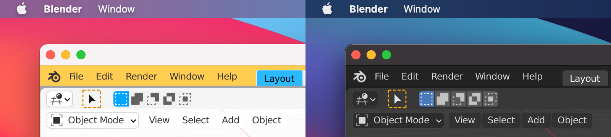

# 🌗 Blender-Auto-Dark-Mode
This add-on for [Blender](https://www.blender.org) lets you choose separate UI themes for light and dark mode and automatically matches the light/dark mode of your operating system. If you have your computer automatically switch between light and dark mode throughout the day, this add-on will keep Blender in sync as it changes.

Auto Dark Mode will match the system light/dark mode on macOS 10.14 or newer, Windows 10, or Linux with GTK.

## Installation

## Usage

Once activated, the add-on works automatically. You can change the themes used for light and dark mode under Edit > Preferences > Add-ons > User Interface: Auto Dark Mode.

## ⚠️ Warnings

When Auto Dark Mode is installed, always change your preferred light and dark theme under Preferences > Add-ons > User Interface: Auto Dark Mode. Theme selections from Preferences > Themes will only last until the next light/dark mode switch occurs.

If you have made customizations to individual elements of the Blender user interface in Preferences > Themes, save your customizations as a preset before installing Auto Dark Mode. Otherwise, Auto Dark Mode will overwrite your changes. After installation, choose your saved preset in Preferences > Add-ons > User Interface: Auto Dark Mode.

If you install this on a system that does not support dark mode, only the Light Mode preset within this add-on will be used.

## License

The Auto Dark Mode add-on is available under the GNU GPL v3 license. See the LICENSE file for more info.

This add-on includes the [darkdetect](https://pypi.org/project/darkdetect/) Python package, which is copyright © Alberto Sottile and distributed under the 3-clause BSD License.
